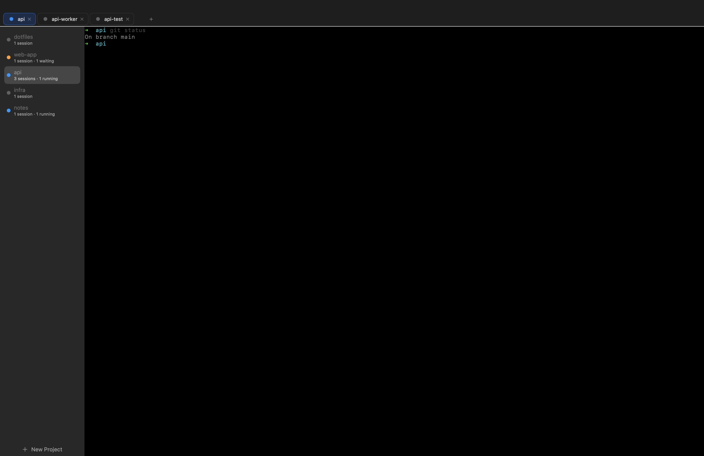

# Copilot Projects

A deliberately small macOS terminal app that organizes CLI sessions by **project**.
Projects are listed vertically in a sidebar; each project's terminal sessions are laid
out horizontally. It keeps the parts of [cmux](https://github.com/manaflow-ai/cmux) that
matter most for working with coding agents — **status indicators** and **notifications** —
and drops everything else.



It replaces cmux's Ghostty integration (a GPU renderer behind several AppKit/portal
layers) with [SwiftTerm](https://github.com/migueldeicaza/SwiftTerm), a pure-Swift terminal
view. The result is a few Swift files instead of hundreds.

## Features

- **Projects (vertical sidebar):** a project is just a named group of sessions. Create one
  with `⌘N` (name it; no folder required). Jump to one with **`⌘1`–`⌘9`**.
- **Sessions (browser-style tabs):** each project shows a horizontal tab strip; one terminal
  is visible at a time. Add a tab with `⌘T`, switch with a click / **`⌃Tab`** (next) / `⌃⇧Tab`
  (prev) / **`⌃1`–`⌃9`** / `⌘⇧[` / `⌘⇧]`, close with `⌘W` or the tab's ✕. Background tabs keep
  running. Hold **⌘** (projects) or **⌃** (tabs) to see the number on each.
- **Status:** each session reports `idle` / `running` / `waiting`. The sidebar dot rolls
  up per project (orange if anything is waiting, blue if anything is running, grey if idle).
  With the Copilot CLI hooks installed (below), this is driven automatically.
- **Notifications:** post a native macOS banner from any session; clicking it focuses the
  originating project/session. Unread sessions get a bell badge + a Dock badge count.
- **Control socket + CLI:** the same `copilot-projects` binary is also a CLI that talks to the
  running app over a Unix socket — ideal for agent hooks.
- **Resumable sessions:** each terminal runs under a bundled [dtach](https://github.com/crigler/dtach),
  so quitting/relaunching/crashing the app does **not** kill your shells or in-flight agents.
  Relaunch reattaches. You can also `ssh` into the machine and `copilot-projects attach` to reconnect
  from another host.
- **Persistence:** projects/sessions are restored on relaunch.

## Build & run

Requires Xcode 15+ (Swift 5.9+), macOS 13+.

```bash
./scripts/build-app.sh --launch        # debug build -> dist/Copilot Projects.app, then open it
./scripts/build-app.sh --release        # optimized build
```

`build-app.sh` runs `swift build`, assembles `dist/Copilot Projects.app` (with `Info.plist`,
the SwiftTerm resource bundle, and an ad-hoc code signature so notifications work), and
prints the app path.

On first launch the app symlinks its binary to `~/.local/bin/copilot-projects`. Put that on your
`PATH` to use the CLI from anywhere:

```bash
export PATH="$HOME/.local/bin:$PATH"
copilot-projects ping            # -> pong
```

> **Note:** if `swift build` fails with `cannot use bare repository … safe.bareRepository is
> 'explicit'`, your global git config blocks SwiftPM's clone. `build-app.sh` already injects
> an override; to run `swift build` directly, prefix it with
> `GIT_CONFIG_COUNT=1 GIT_CONFIG_KEY_0=safe.bareRepository GIT_CONFIG_VALUE_0=all`.

## CLI

Inside a copilot-projects terminal, `COPILOT_PROJECTS_PROJECT` / `COPILOT_PROJECTS_SESSION` /
`COPILOT_PROJECTS_SOCKET` are set, so commands auto-target the current session.

```bash
copilot-projects set-status running               # set the current session's status
copilot-projects set-status waiting --text "review my diff"
copilot-projects notify "Build finished" "All tests green"
copilot-projects list-projects
copilot-projects list-status
copilot-projects new-project myapp                # name only; --cwd optional
copilot-projects new-session --project <id> --cwd /tmp
copilot-projects focus --session <id>             # bring app forward + select
copilot-projects install-hooks                    # wire up Copilot CLI status hooks
copilot-projects help
```

Targeting flags (`--project`, `--session`) override the environment defaults.

## Copilot CLI integration (automatic status)

So the status dot tracks a coding agent without any manual calls, copilot-projects installs a
[Copilot CLI hook](https://docs.github.com/copilot) bridge into `~/.copilot/hooks/`
(`copilot-projects-hook.sh` + `copilot-projects.json`) the first time the app launches. It maps the
agent lifecycle to status:

| Copilot CLI event | status |
| --- | --- |
| `sessionStart` | `idle` |
| `userPromptSubmitted` | `running` |
| `preToolUse` (tool = `ask_user`) | `waiting` |
| `postToolUse` (tool = `ask_user`) | `running` |
| `agentStop` | `idle` |
| `sessionEnd` | `idle` |

The hook no-ops outside a copilot-projects terminal (it checks `COPILOT_PROJECTS_SESSION`), so it
coexists with other integrations (e.g. cmux) and is safe to leave installed globally. Manage
it with `copilot-projects install-hooks` / `uninstall-hooks`. Start a new Copilot CLI session to
pick up changes.

**Liveness backstop.** Stop/exit hooks can be missed (a crash, `kill`, a closed terminal), so
the app also reconciles: a session can only stay `running`/`waiting` while its shell actually
hosts a live `copilot` process. The moment the agent exits, the dot drops to idle — and it is
never cleared while the agent is genuinely working (no timing guesswork). Tune the detected
process names with `COPILOT_PROJECTS_AGENT_PROCESSES` (comma-separated, default `copilot`) or turn
the check off with `COPILOT_PROJECTS_LIVENESS=0`.

For other agents, call the CLI from their hooks directly:

```bash
copilot-projects set-status running
copilot-projects set-status waiting --text "needs approval"
copilot-projects notify "Agent needs input"
copilot-projects set-status idle
```

## Resumability & SSH reattach

Each session's shell runs under a bundled, universal [dtach](https://github.com/crigler/dtach)
(GPLv2; source vendored in `vendor/dtach`). dtach forwards raw bytes — it is **not** a second
terminal emulator — so keyboard, title (OSC 0/2) and cwd (OSC 7) all stay native; SwiftTerm is
the only emulator.

- **Quit / relaunch / crash:** the dtach master daemonizes away from the app, so shells +
  agents keep running. Relaunch reattaches (`dtach -A`).
- **Close a tab (⌘W / ✕):** *ends* that session (kills its dtach master).
- **Reconnect from another host:**
  ```bash
  ssh you@mac
  copilot-projects ls                 # list sessions + ids
  copilot-projects attach <id|prefix> # raw reattach in this terminal (Ctrl-\ to detach)
  ```
- **Tradeoff:** scrollback *history* doesn't survive a detach (a full-screen TUI like copilot
  repaints on reattach; a plain shell starts fresh). Live scrollback while attached is normal.

Sockets live under `~/.local/state/copilot-projects/sessions/`. If the bundled dtach is missing,
sessions fall back to plain (non-resumable) shells. Override the helper with `COPILOT_PROJECTS_DTACH`.

## How it works

- One executable, two roles (`Sources/copilot-projects/main.swift`): a recognized subcommand runs
  the CLI client; anything else launches the SwiftUI app.
- `Sources/CopilotProjectsCore` is Foundation-only: paths, the JSON-line wire protocol, the socket
  client, and CLI parsing.
- The app keeps value-type `Project`/`Session` state in `AppModel` and holds the live
  SwiftTerm views **outside** the observable graph (`controllers` dictionary), so SwiftUI
  list diffing stays cheap.
- `ControlServer` listens on `~/.local/state/copilot-projects/control.sock` (mode 0600 in a 0700
  dir); each connection is one JSON request → one JSON response.
- State is persisted to `~/.local/state/copilot-projects/state.json`.

Override locations with `COPILOT_PROJECTS_SOCKET` and `COPILOT_PROJECTS_STATE_DIR` (useful for running
an isolated instance).

## License

MIT.
